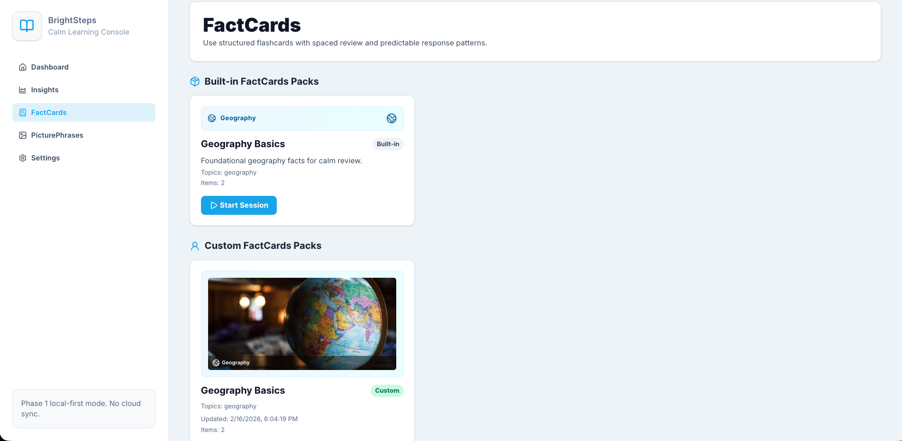
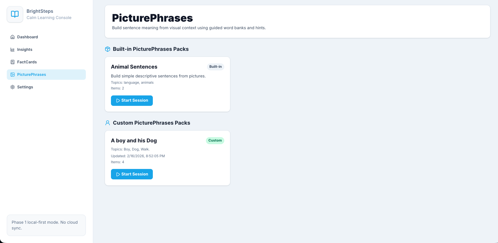
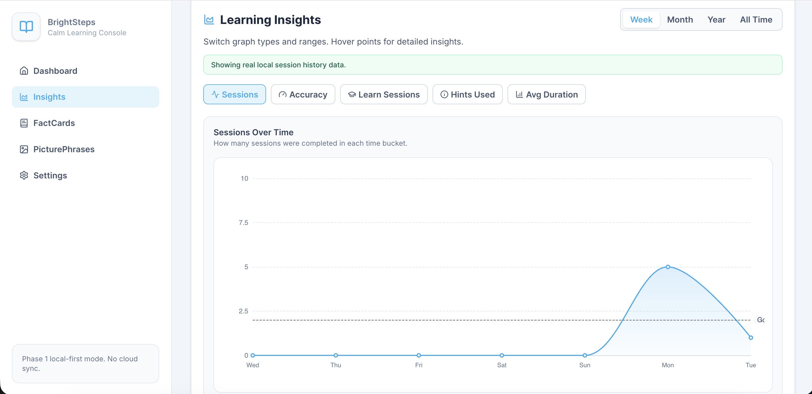
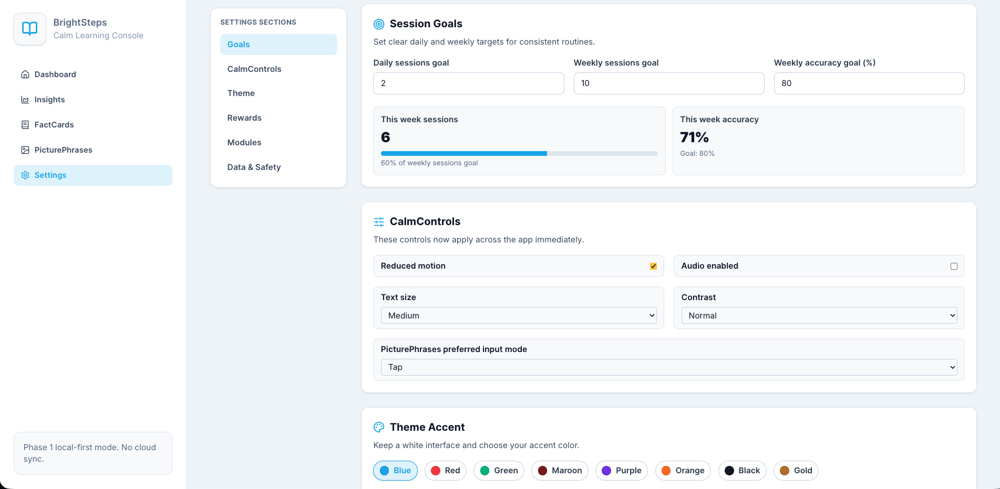

# BrightSteps

`License: GPL-3.0-only`

BrightSteps is a calm, local-first learning app for autistic kids and their families.
It is designed to make practice predictable, visual, and low-stress.
Caregivers can create and manage learning packs, run sessions, and track progress without requiring accounts.

## What BrightSteps Does

- Gives children structured practice through visual learning modules
- Supports both guided learning and quiz-style review
- Lets caregivers create/edit packs with UI mode or JSON mode
- Uses local storage by default for privacy and reliability
- Adds reward-based motivation tied to completed pack goals

## Core Modules

### FactCards

FactCards is a structured Q&A module.



- Prompt + answer cards with optional image/audio
- Multiple options and hint support
- Built-in packs and custom packs
- Learn mode and timed Review mode

### PicturePhrases

PicturePhrases is an image-based sentence-building module.



- Upload image(s) and generate sentence practice
- Tap, drag, or type input modes
- Story mode supports bulk uploads with ordering
- AI-generated sentence groups, word banks, and hints

## Session Experience

- `Learn` mode: untimed, guided, support-first
- `Review` mode: timed, quiz-like, with result feedback
- Session summary tracks accuracy, hints, and completion

## Dashboard and Insights


- Daily/weekly goal tracking
- Accuracy and completion summaries
- Rewards progress at the top of dashboard
- Insights page for progress and accuracy trends



## Rewards

Caregivers can define rewards in Settings:

- Reward title
- Target completed packs
- Optional notes

When a child crosses a configured threshold during real session completion, a reward modal appears.

## Settings and CalmControls



Settings currently include:

- Theme accent selection with reset to default (blue)
- Reduced motion toggle
- Audio toggle
- Text size and contrast controls
- Daily and weekly goals
- Reward configuration
- Module manager entry points

## Privacy and Data Model

- Local-first by default
- No required user accounts in this phase
- No analytics/ad-tech tracking
- Client-side local data: settings, custom FactCards packs, session history
- App-side local persistence: SQLite-backed PicturePhrases + AI caches

## Quick Start

### 1) Requirements

- Node.js LTS
- `pnpm`

### 2) Install

```bash
pnpm install
```

### 3) Configure Environment

Copy the template:

```bash
cp apps/web/.env.local.example apps/web/.env.local
```

Add keys in `apps/web/.env.local`:

- `OPENAI_API_KEY`
- `GEMINI_API_KEY` (recommended fallback)

### 4) Run

```bash
pnpm dev
```

Then open `http://localhost:3000`.

## Common Commands

```bash
pnpm dev
pnpm build
pnpm lint
pnpm test
pnpm test:e2e
```

## Project Structure

```text
apps/web/                   Next.js app (UI + API routes)
content/                    Built-in content packs
packages/content-schema/    Shared schema + validation
packages/spaced-repetition/ Review logic
brightsteps.md              Product notes / PRD
```

## Safety Notice

BrightSteps is an educational support tool only.
It is not therapy, diagnosis, or medical advice.

- [DISCLAIMER.md](DISCLAIMER.md)
- [SECURITY.md](SECURITY.md)
- [TRADEMARK.md](TRADEMARK.md)

## Contributing

Please read [CONTRIBUTING.md](CONTRIBUTING.md) before opening pull requests.

## License

BrightSteps is licensed under [GNU GPL v3.0 only](LICENSE) (`GPL-3.0-only`).
